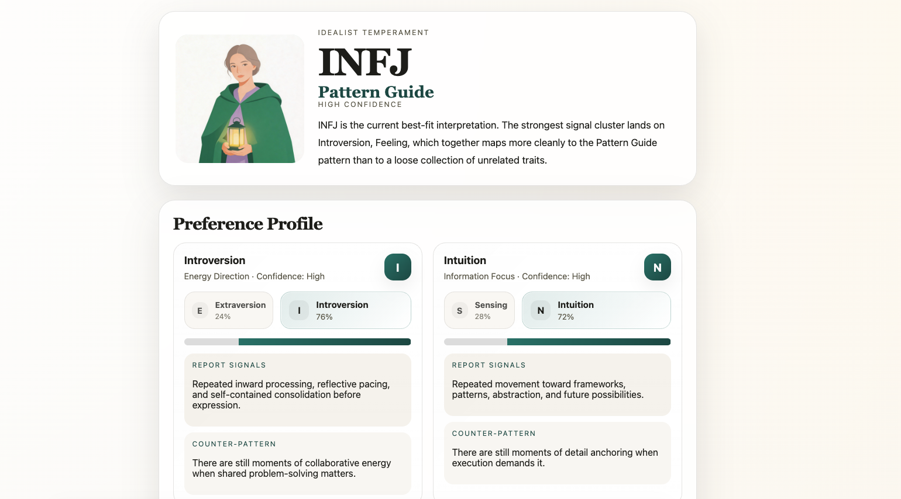
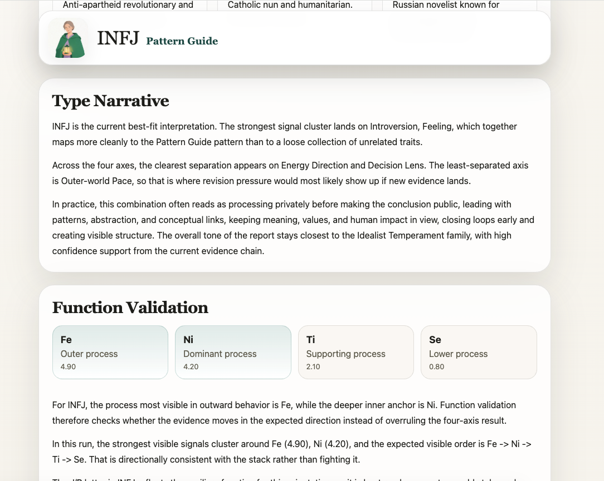

# MBTI Skill

[English](../../README.md) | [简体中文](README.md)

基于你与 agents 的对话历史等信息推断 MBTI 类型，大幅减少填写问题的时间，目前支持 [OpenClaw](https://openclaw.ai/) skills。

## 快速开始

### 给人类用户

```bash
# 安装
openclaw skills install mbti-analyzer

# 在 OpenClaw 中运行
mbti-report
```

你也可以用这些触发词：`MBTI`、`personality analysis`、`type me`、`分析我的 MBTI`

### 给 OpenClaw

```text
帮我安装这个 skill，并分析我的 MBTI：openclaw skills install mbti-analyzer
```

## 工作方式

```
发现 → 分析 → 报告
```

“发现”阶段会识别工作区和 OpenClaw 状态目录中的候选数据来源类别。“分析”阶段只会使用你允许的来源，构建可追溯的证据池，并在不确定性仍然较高时继续追问少量问题。“报告”阶段会输出最终的 HTML 和 Markdown 报告。

## 信任边界与范围

- 候选来源可能包括工作区长期记忆（`MEMORY.md`）、工作区日常笔记（`memory/*.md`）、OpenClaw sessions、memory index 记录、task 元数据和 cron 元数据。
- skill 默认会排除敏感或低信号路径，例如 `.env`、`credentials/*`、`identity/*`、审批文件、通用配置文件和运行时日志。
- 每次运行只会读取你允许使用的数据来源。
- 除非显式关闭引用，报告中可能包含来自已允许来源的简短摘录。

## 报告预览

以下截图展示的是英文版报告界面。skill 同样支持生成中文版报告，只是当前还没有补充中文版截图。

### 总览

生成报告的总览页

<p align="center">
  
</p>

### 叙事与验证

<p align="center">
  
</p>

## 你会得到什么

- 一个带有明确置信度的 MBTI 最优假设结果。
- 一份解释各维度如何被评分的偏好画像。
- 一条可追溯的证据链，而不是直接从原始历史里猜测。
- 相邻类型比较，说明为什么接近的替代类型没有胜出。
- 当证据过于接近时给出不确定性说明和后续追问提示。
- 根据来源语言分布自动切换英文或中文报告输出。

## 参考资料

| 文档 | 用途 |
|---|---|
| [`SKILL.md`](SKILL.md) | Skill 契约、维护者说明和分阶段工作流细节 |
| [`references/analysis_framework.md`](references/analysis_framework.md) | 四维偏好与认知功能分析模型 |
| [`references/evidence_rubric.md`](references/evidence_rubric.md) | 信号强度评分与伪信号过滤规则 |
| [`references/report_copy_contract.md`](references/report_copy_contract.md) | 报告文案与语气规则 |
| [`references/report_structure.md`](references/report_structure.md) | 报告结构布局 |

## 许可证

MIT
